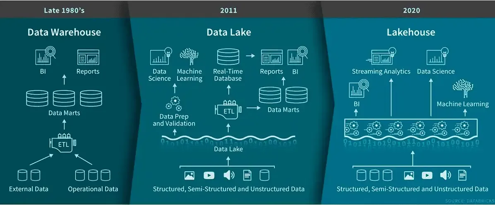

# Os 5 V´s do Big Data
## Volume
 um grande  volume de dados, tanto estruturados quantos não estruturados

## velocidade
 big data é um fluxo constante de dados que chega em grande velocidade e deve ser tratado rapidamente

## variedade
 big data vem em todos os tipos de formatos - de estruturados até não estruturados, como dados numéricos em um banco de dados tradicional, a não estruturados como imagens, vídeos, etc.

## veracidade
 com o aumento das fontes de dados, a veracidade dos dados se torna cada vez mais importante, pois a qualidade dos dados pode variar significativamente

## valor
 o objetivo do big data é obter insights valiosos dos dados para melhorar os negócios, identificar tendências e tomar decisões mais informadas

 
